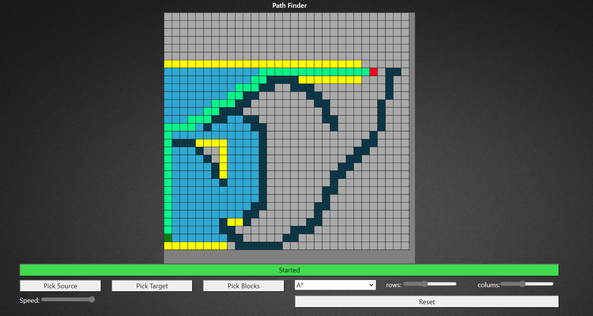

# Path Finder
My Project for the Artificial Intelligence course.
## How it was done
I used the p5.js library for the animations. The overall structure of the project is inspired by the strategy design pattern I read about recently in Head First Design Patterns book.

>The Strategy Pattern defines a family of algorithms,
>encapsulates each one, and makes them interchangeable.
>Strategy lets the algorithm vary independently from
>clients that use it.

For this project, the search algorithms (ie. A* and BFS) represent the family of algorithms in the definition, where I encapsulated each one in a separate class and made them interchangeable in run time. 
The grid is the 'client' that uses these algorithms
## Currently available algorithms:
- A*
- Breadth-First Search

You can try it live [HERE](https://shamelj.github.io/Path-Finder/) 

